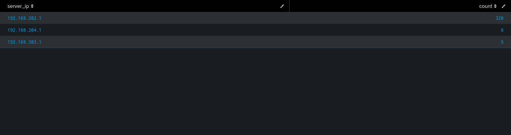

# Rogue DHCP Detection & Network Behavior Analysis Using Splunk

---

##  Overview

This project focuses on detecting abnormal DHCP activity and analyzing lease distribution patterns using Splunk and Zeek DHCP logs.

The objective was to identify multiple DHCP servers within the environment and investigate potential rogue DHCP behavior.

---

##  Objective

To analyze DHCP lease activity and detect suspicious or abnormal DHCP server behavior within a monitored network.

---

##  Lab Setup

- **Log Source:** Zeek (`dhcp.log`)
- **SIEM:** Splunk
- **Environment:** Virtual Lab (Kali Linux + VirtualBox)

---

##  Dataset

The DHCP logs contained:

- Client IP addresses
- DHCP server IP addresses
- MAC addresses
- Lease assignment activity

---

##  Detection Methodology

### 1. DHCP Server Enumeration

Used Splunk statistical analysis to identify DHCP servers observed within the environment.

```spl
index=main sourcetype=zeek_dhcp
| rex field=_raw "(?<ts>\d+\.\d+)\s+(?<uid>\S+)\s+(?<client_ip>\d+\.\d+\.\d+\.\d+)\s+(?<client_port>\d+)\s+(?<server_ip>\d+\.\d+\.\d+\.\d+)\s+(?<server_port>\d+)\s+(?<mac>[0-9a-f:]{17})"
| stats count by server_ip
| sort - count
```

---

##  Analysis & Findings

| Server IP | Lease Count |
|-----------|-------------|
| 192.168.202.1 | 320 |
| 192.168.204.1 | 8 |
| 192.168.203.1 | 5 |

---

##  Key Observations

- One DHCP server handled the majority of lease assignments
- Additional DHCP servers were observed with lower activity
- Multiple DHCP servers may indicate:
  - segmented infrastructure
  - network misconfiguration
  - potential rogue DHCP behavior

---

##  Sample Output



---

##  SOC Insight

Multiple DHCP servers within a network should always be validated during investigations.

Abnormal DHCP behavior can lead to:

- traffic interception
- network manipulation
- man-in-the-middle opportunities

Detection engineering requires analysts to validate anomalies before classifying them as threats.

---

##  Key Takeaway

Behavioral analysis is critical in modern SOC operations.

Not every anomaly is malicious, but every anomaly should be investigated.

---

##  Next Steps

- Correlate DHCP activity with DNS traffic
- Identify suspicious host behavior
- Develop detection rules for rogue infrastructure activity

---

##  Tags

`Splunk` `Zeek` `DHCP` `Threat Hunting` `Detection Engineering` `SOC Analyst`
